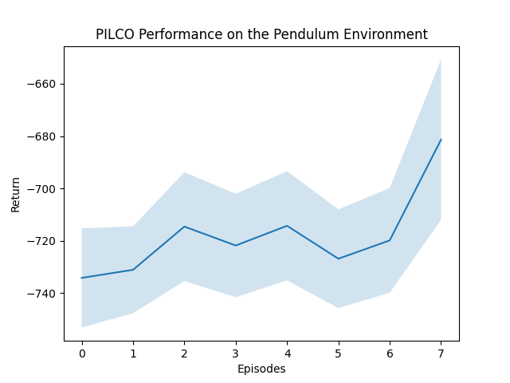

# PILCO
## STEPS TO CREATE THE CONDA ENVIRONMENT by Sandilya Sai Garimella (SSG). Please add to it if you find any fixes.
1. `conda create -n pilco python=3.7`
2. `conda activate pilco`
3. `pip install tensorflow==2.10.0`
4. `pip install gpflow`
5. `pip install gym`
6. `pip install 'cython<3'`
7. `pip install mujoco-py`

## COMPLETE conda list PACKAGES which SSG had to make this repo work:
(pilco) ssg@ssg-dellxps:~/PILCO$ conda list

packages in environment at /home/ssg/conda/envs/pilco:

Name Version Build Channel

_libgcc_mutex             0.1                 conda_forge    conda-forge
_openmp_mutex             4.5                       2_gnu    conda-forge
absl-py                   2.1.0                    pypi_0    pypi
astunparse                1.6.3                    pypi_0    pypi
backcall                  0.2.0                    pypi_0    pypi
ca-certificates           2025.1.31            hbcca054_0    conda-forge
cachetools                5.5.2                    pypi_0    pypi
certifi                   2025.1.31                pypi_0    pypi
cffi                      1.15.1                   pypi_0    pypi
charset-normalizer        3.4.1                    pypi_0    pypi
check-shapes              1.1.1                    pypi_0    pypi
cloudpickle               2.2.1                    pypi_0    pypi
cycler                    0.11.0                   pypi_0    pypi
cython                    0.29.37                  pypi_0    pypi
decorator                 5.1.1                    pypi_0    pypi
deprecated                1.2.18                   pypi_0    pypi
dm-tree                   0.1.8                    pypi_0    pypi
dropstackframe            0.1.0                    pypi_0    pypi
fasteners                 0.19                     pypi_0    pypi
flatbuffers               25.2.10                  pypi_0    pypi
fonttools                 4.38.0                   pypi_0    pypi
gast                      0.4.0                    pypi_0    pypi
glfw                      2.8.0                    pypi_0    pypi
google-auth               2.38.0                   pypi_0    pypi
google-auth-oauthlib      0.4.6                    pypi_0    pypi
google-pasta              0.2.0                    pypi_0    pypi
gpflow                    2.9.2                    pypi_0    pypi
grpcio                    1.62.3                   pypi_0    pypi
gym                       0.26.2                   pypi_0    pypi
gym-notices               0.0.8                    pypi_0    pypi
h5py                      3.8.0                    pypi_0    pypi
idna                      3.10                     pypi_0    pypi
imageio                   2.31.2                   pypi_0    pypi
importlib-metadata        6.7.0                    pypi_0    pypi
ipython                   7.34.0                   pypi_0    pypi
jedi                      0.19.2                   pypi_0    pypi
keras                     2.10.0                   pypi_0    pypi
keras-preprocessing       1.1.2                    pypi_0    pypi
kiwisolver                1.4.5                    pypi_0    pypi
lark                      1.1.9                    pypi_0    pypi
ld_impl_linux-64          2.43                 h712a8e2_4    conda-forge
libclang                  18.1.1                   pypi_0    pypi
libffi                    3.4.6                h2dba641_0    conda-forge
libgcc                    14.2.0               h767d61c_2    conda-forge
libgcc-ng                 14.2.0               h69a702a_2    conda-forge
libgomp                   14.2.0               h767d61c_2    conda-forge
liblzma                   5.6.4                hb9d3cd8_0    conda-forge
liblzma-devel             5.6.4                hb9d3cd8_0    conda-forge
libnsl                    2.0.1                hd590300_0    conda-forge
libsqlite                 3.49.1               hee588c1_1    conda-forge
libstdcxx                 14.2.0               h8f9b012_2    conda-forge
libstdcxx-ng              14.2.0               h4852527_2    conda-forge
libzlib                   1.3.1                hb9d3cd8_2    conda-forge
markdown                  3.4.4                    pypi_0    pypi
markupsafe                2.1.5                    pypi_0    pypi
matplotlib                3.5.3                    pypi_0    pypi
matplotlib-inline         0.1.6                    pypi_0    pypi
mujoco-py                 2.1.2.14                 pypi_0    pypi
multipledispatch          1.0.0                    pypi_0    pypi
ncurses                   6.5                  h2d0b736_3    conda-forge
numpy                     1.21.6                   pypi_0    pypi
oauthlib                  3.2.2                    pypi_0    pypi
openssl                   3.4.1                h7b32b05_0    conda-forge
opt-einsum                3.3.0                    pypi_0    pypi
packaging                 24.0                     pypi_0    pypi
pandas                    1.3.5                    pypi_0    pypi
parso                     0.8.4                    pypi_0    pypi
pexpect                   4.9.0                    pypi_0    pypi
pickleshare               0.7.5                    pypi_0    pypi
pillow                    9.5.0                    pypi_0    pypi
pip                       24.0               pyhd8ed1ab_0    conda-forge
prompt-toolkit            3.0.48                   pypi_0    pypi
protobuf                  3.19.6                   pypi_0    pypi
ptyprocess                0.7.0                    pypi_0    pypi
pyasn1                    0.5.1                    pypi_0    pypi
pyasn1-modules            0.3.0                    pypi_0    pypi
pycparser                 2.21                     pypi_0    pypi
pygments                  2.17.2                   pypi_0    pypi
pyparsing                 3.1.4                    pypi_0    pypi
python                    3.7.12          hf930737_100_cpython    conda-forge
python-dateutil           2.9.0.post0              pypi_0    pypi
pytz                      2025.1                   pypi_0    pypi
readline                  8.2                  h8c095d6_2    conda-forge
requests                  2.31.0                   pypi_0    pypi
requests-oauthlib         2.0.0                    pypi_0    pypi
rsa                       4.9                      pypi_0    pypi
scipy                     1.7.3                    pypi_0    pypi
setuptools                69.0.3             pyhd8ed1ab_0    conda-forge
six                       1.17.0                   pypi_0    pypi
sqlite                    3.49.1               h9eae976_1    conda-forge
tabulate                  0.9.0                    pypi_0    pypi
tensorboard               2.10.1                   pypi_0    pypi
tensorboard-data-server   0.6.1                    pypi_0    pypi
tensorboard-plugin-wit    1.8.1                    pypi_0    pypi
tensorflow                2.10.0                   pypi_0    pypi
tensorflow-estimator      2.10.0                   pypi_0    pypi
tensorflow-io-gcs-filesystem 0.34.0                   pypi_0    pypi
tensorflow-probability    0.18.0                   pypi_0    pypi
termcolor                 2.3.0                    pypi_0    pypi
tk                        8.6.13          noxft_h4845f30_101    conda-forge
traitlets                 5.9.0                    pypi_0    pypi
typing-extensions         4.7.1                    pypi_0    pypi
urllib3                   2.0.7                    pypi_0    pypi
wcwidth                   0.2.13                   pypi_0    pypi
werkzeug                  2.2.3                    pypi_0    pypi
wheel                     0.42.0             pyhd8ed1ab_0    conda-forge
wrapt                     1.16.0                   pypi_0    pypi
xz                        5.6.4                hbcc6ac9_0    conda-forge
xz-gpl-tools              5.6.4                hbcc6ac9_0    conda-forge
xz-tools                  5.6.4                hb9d3cd8_0    conda-forge
zipp                      3.15.0                   pypi_0    pypi


[](LICENSE)

An Implementation of PILCO: Probabilistic Inference for Learning Control on the Pendulum
environment

<p align="center">
  
</p>

## Install

We recommend using a conda virtual environment. Installation assumes that the
user already has a MuJuCo licence available at: https://www.roboti.us/license.html

```
conda create -n pilco python==3.7
conda activate pilco

pip install tensorflow==2.2.0
pip install gpflow==2.0.0
pip install gast==0.3.3
pip install gym
pip3 install -U 'mujoco-py<2.1,>=2.0'
conda install matplotlib pandas pytest
```

## Usage

The example may be run as follows:

```
python pendulum_example.py
```

where the default hyperparameter values have been configured to produce a plot resembling the
one below. Random seeds are not fixed and so different plots will be obtained every time
the script is run. There is considerable scope for hyperparameter tuning!

<p align="center">
  
</p>

## References

The following excellent open-source projects: https://github.com/nrontsis and 
https://github.com/aidanscannell/pilco-tensorflow proved to be highly valuable references.
 
